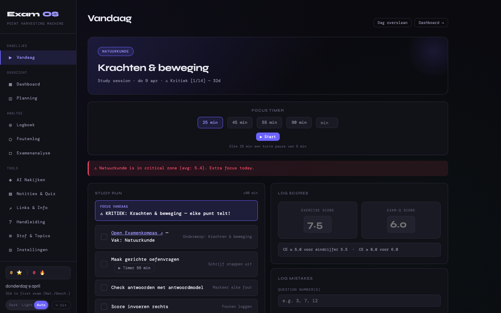
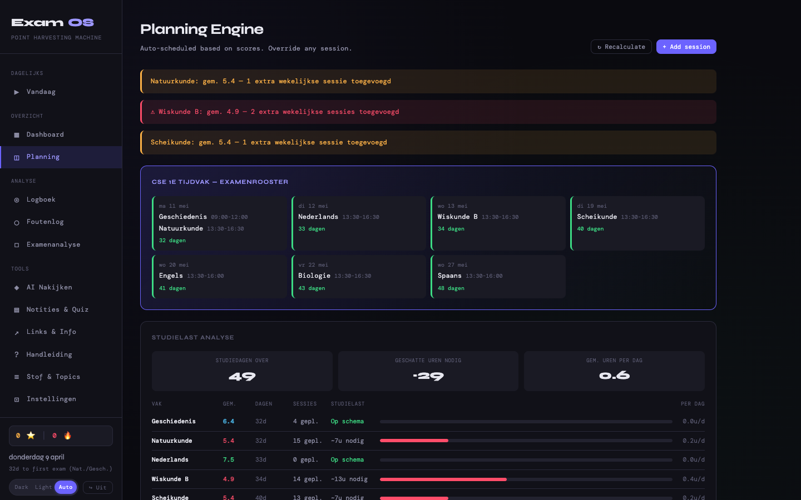
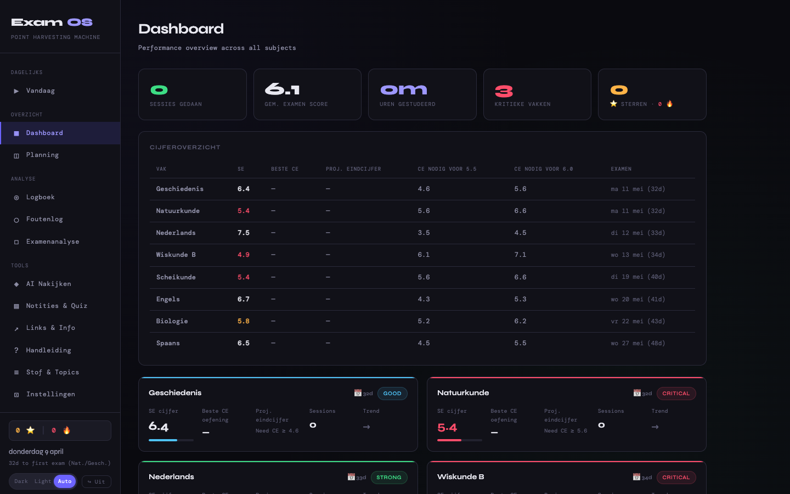
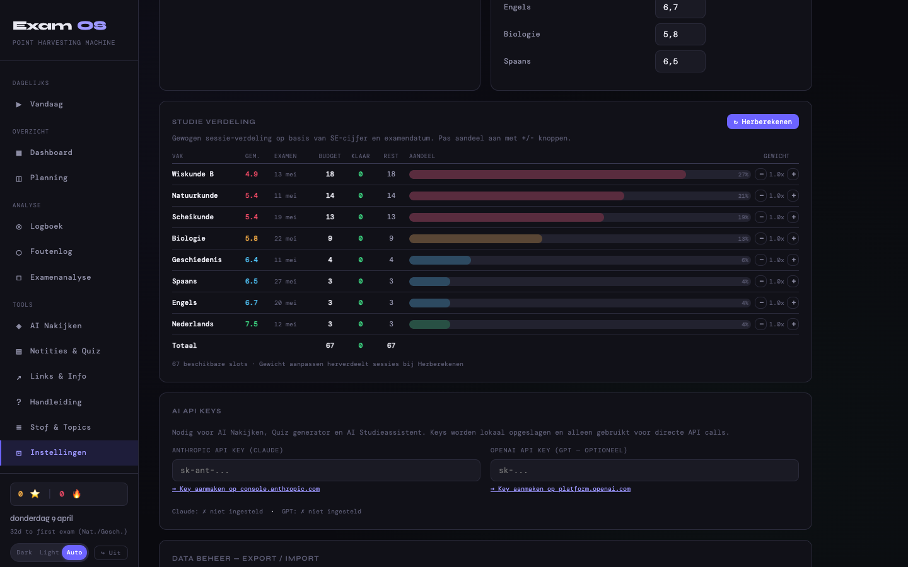

<div align="center">

# ExamOS — Jussi Edition

**Persoonlijk trainingssysteem voor Jussi's VWO eindexamen 2026**

[](https://exam-os-three.vercel.app)
[](LICENSE)
[](https://claude.com/claude-code)

**[📱 Live App](https://exam-os-three.vercel.app)** · **[📖 Setup Guide](#-getting-started)** · **[🎯 Features](#features)**



</div>

---

> **Point Harvesting Machine** — Jussi-specifieke versie met zijn echte SE-cijfers, examen-rooster en credentials. Gebouwd voor één specifieke leerling.
>
> Voor andere leerlingen → zie [ExamOS-2026](https://github.com/ColdDesertLab/ExamOS-2026) (generic template voor 2026) of [ExamOS-2027](https://github.com/ColdDesertLab/ExamOS-2027) (voor 2027).

---

## 🎯 Welke versie heb ik nodig?

| Versie | Doelgroep | Data | Login |
|--------|-----------|------|-------|
| **[ExamOS — Jussi Edition](https://github.com/ColdDesertLab/ExamOS)** ← je bent hier | Jussi persoonlijk (VWO 2026) | Zijn echte cijfers + rooster | `Jussi` / `Jones2026!` |
| [ExamOS-2026](https://github.com/ColdDesertLab/ExamOS-2026) | Andere 2026 VWO/HAVO studenten | Demo data + echte mei 2026 datums | `demo` / `demo` |
| [ExamOS-2027](https://github.com/ColdDesertLab/ExamOS-2027) | 2027 VWO/HAVO studenten | Demo data + placeholder datums | `demo` / `demo` |

---

## 🚀 Getting Started

Drie manieren om ExamOS te gebruiken:

### 1. Online — Add to Home Screen (aanbevolen)

Open **[exam-os-three.vercel.app](https://exam-os-three.vercel.app)** en voeg toe aan je startscherm. Werkt op iPad, iPhone, macOS en Android.

| Apparaat | Stappen |
|----------|---------|
| **iPad / iPhone** | Safari → Delen-knop → "Zet op beginscherm" |
| **macOS** | Chrome → ⋮ menu → "ExamOS installeren" (verschijnt in Launchpad en Dock) |
| **macOS (Safari)** | Bestand → "Toevoegen aan Dock" |
| **Android** | Chrome → ⋮ menu → "App installeren" |

Na installatie: icoon op je beginscherm, standalone mode zonder browser-balk, auto-sync tussen apparaten via Supabase.

### 2. Self-host — One-liner installer

```bash
curl -fsSL https://raw.githubusercontent.com/ColdDesertLab/ExamOS/master/install.sh | bash
examos
```

Cloned repo naar `~/.examos`, installeert launcher in `~/.local/bin/examos`, start lokale server en opent app. Auto-update per run (`EXAMOS_NO_UPDATE=1` om uit te schakelen).

### 3. Manueel clonen

```bash
git clone https://github.com/ColdDesertLab/ExamOS.git
cd ExamOS
python3 -m http.server 8000
# open http://localhost:8000/ExamOS_v4.html
```

---

## 📱 PWA Home Screen Setup

### iPad / iPhone
1. Open **exam-os-three.vercel.app** in Safari
2. Tap deel-knop (vierkantje met pijl omhoog)
3. Scroll omlaag → **"Zet op beginscherm"** → **"Voeg toe"**
4. App verschijnt full-screen op beginscherm, geen Safari-balk

### macOS (Chrome / Edge / Arc)
1. Open in Chrome → klik ⋮-menu rechtsboven
2. **"ExamOS installeren..."** (of install-icoon in adresbalk)
3. Verschijnt in **Applications** + **Launchpad** → sleep naar Dock

### macOS (Safari)
1. **Bestand** → **"Toevoegen aan Dock..."** → **Toevoegen**

### Android
1. Chrome → ⋮ → **"App installeren"** of **"Toevoegen aan startscherm"**

---

## 🔄 Cross-device Sync

Eenmaal ingelogd: automatische Supabase sync.
- iMac → sessie afronden → iPad ziet scores binnen seconden
- Planning aanpassen op telefoon → MacBook dashboard updatet automatisch
- Offline support: wijzigingen syncen zodra verbinding terug is

Sync indicator in sidebar toont real-time status.

---

## 📸 Screenshots

| | |
|---|---|
|  |  |
| Planning page met examenrooster + studielast analyse | Dashboard met sessies, sterren, subject cards |


> Interactieve studie verdeling in Instellingen — pas het gewicht per vak aan met +/- knoppen

---

## ⚙️ Smart Features

### Auto-recalculate bij stale planning
Als je een paar dagen niet opent (ziek, vakantie, vergeten), detecteert de app verlopen sessies bij de volgende start en **herbereken automatisch** de planning vanaf vandaag. Geen handmatige actie nodig.

### Setup Wizard
7-stap wizard (naam, vakken, SE cijfers, examendatums, topics) beschikbaar via **Instellingen → Wizard opnieuw doen**. Gebruikt voor volledige herconfiguratie.

### Sterren & Gamification
- **Sterren verdienen**: sessie afronden (+1), score ≥7.0 (+1), score ≥8.0 (+2), bonus activiteiten (+1)
- **Streak**: consecutive dagen met afgeronde sessies — milestones op 3d (+2), 7d (+5), 14d (+10)
- **Week bonus**: alle sessies van de week af → +3 sterren
- Sidebar-teller + dashboard stats card

### Bonus Activiteiten (na dag-klaar)
4 bonus kaarten voor extra sterren:
1. **Extra Sessie** — nieuwe sessie voor het zwakste beschikbare vak
2. **Fouten Herhaling** — interactieve review van laatste fouten
3. **Theorie Uitleg** — AI samenvatting of formulekaart
4. **Flashcard Quiz** — snelle herhaling met kaartjes

---

## 🤖 AI Features — Hoe werkt de API?

De app zelf (planner, timer, foutenlog, sterren, wizard) **werkt zonder API key**. Alleen de AI-features vereisen een key:

| Feature | API nodig | Waar invoegen |
|---------|-----------|---------------|
| Planner, timer, sterren, foutenlog | ❌ Nee | — |
| AI Grader (examens nakijken) | ✅ Anthropic | Instellingen → API Keys |
| Quiz Generator | ✅ Anthropic of OpenAI | Instellingen → API Keys |
| AI Studieassistent (chat) | ✅ Anthropic of OpenAI | Instellingen → API Keys |
| Topic samenvattingen | ✅ Anthropic of OpenAI | Instellingen → API Keys |

**Belangrijk:** Dit is de **Anthropic API / OpenAI API** (pay-per-token), **niet je Claude.ai of ChatGPT abonnement**. Die abonnementen geven geen API-toegang.

- **Anthropic API key**: [console.anthropic.com/settings/keys](https://console.anthropic.com/settings/keys) — credit kopen vanaf $5
- **OpenAI API key**: [platform.openai.com/api-keys](https://platform.openai.com/api-keys) — prepaid credit

Keys worden **lokaal opgeslagen** in je browser en direct naar de API gestuurd (geen tussenserver). Typisch gebruik: één examen nakijken ≈ $0.05-0.15 Claude / $0.02-0.08 GPT-4o.

---

## 🧠 Planning Engine

Gewogen budget-systeem met examen-bewuste scheduling:

### Gewicht per vak
- **Score deficit**: `max(0, 6.5 - huidig_niveau)` — zwakke vakken meer sessies
- **Tijdsdruk**: `√(36 / dagen_tot_examen)` — eerdere examens front-loaded
- **Handmatige override**: 0.2x – 3.0x multiplier via Instellingen

### Jussi's verdeling (startdatum 9 april 2026)

| Vak | SE | Budget | Aandeel |
|-----|-----|--------|---------|
| Wiskunde B | 4.9 | ~19 | 27% |
| Natuurkunde | 5.4 | ~14 | 21% |
| Scheikunde | 5.4 | ~13 | 18% |
| Biologie | 5.8 | ~9 | 13% |
| Geschiedenis | 6.4 | ~4 | 6% |
| Engels | 6.7 | ~3 | 4% |
| Nederlands | 7.5 | ~3 | 4% |
| Spaans | 6.5 | ~3 | 4% |

Na elk afgerond examen vallen slots vrij → resterende vakken krijgen ze automatisch.

### Dagtypes

| Dagtype | Slots | Duur | Logica |
|---------|-------|------|--------|
| Studiedag | 1 | 90 min | Volle focus |
| Zaterdag | 2 | 75 min | Dubbele sessie |
| Zondag | 1 | 60 min | Lichte sessie |
| Examenweek (≤7d) | 2 | 55 min | Intensief |
| Dag vóór examen | 2 | 60 min | Verplicht examenvak + 2e |
| Examendag | 1 | 45 min | Alleen ochtend-review |
| Dubbel examen (11 mei) | 0 | — | Geen studie |
| Dag ná examen | 2 | 45 min | Minder energie |

---

## 📅 Jussi's Examenrooster CSE 2026

| Datum | Vak | Tijd | SE | Status |
|-------|-----|------|----|--------|
| ma 11 mei | Geschiedenis | 09:00-12:00 | 6.4 | Goed |
| ma 11 mei | Natuurkunde | 13:30-16:30 | 5.4 | ⚠ Kritiek |
| di 12 mei | Nederlands | 13:30-16:30 | 7.5 | Sterk |
| wo 13 mei | Wiskunde B | 13:30-16:30 | 4.9 | ⚠ Kritiek |
| di 19 mei | Scheikunde | 13:30-16:30 | 5.4 | ⚠ Kritiek |
| wo 20 mei | Engels | 13:30-16:00 | 6.7 | Goed |
| vr 22 mei | Biologie | 13:30-16:30 | 5.8 | Risico |
| wo 27 mei | Spaans | 13:30-16:00 | 6.5 | Goed |

---

## Features

- **Setup wizard** — 7-stap configuratie via Instellingen
- **Gewogen budget planner** met auto-recalculate bij stale planning
- **Pomodoro timer** (25/45/55/90 min) met fullscreen break overlay
- **AI Grader** — upload examens → Claude/GPT scoring met N-term → auto foutenlog
- **Quiz Generator** — AI meerkeuzevragen per vak, focust op zwakke punten
- **AI Studieassistent** — chat met 4 modes (Leg uit / Voorbeeld / Oefenvraag / Tip)
- **Flashcards** — automatisch uit foutenlog, Opnieuw/Wist ik/Makkelijk rating
- **Formulebladen** voor Wiskunde B, Natuurkunde, Scheikunde, Biologie
- **Oude examens** — directe links naar examenblad.nl per vak per jaar (2018-2024)
- **Foutenlog** met F1-F8 codes en actiepunten
- **Notities** per vak
- **Dag-klaar celebration** — confetti + ster-animatie + bonus kaarten
- **Dashboard** met sterren, streak, subject cards, studielast analyse
- **Studie verdeling tabel** in Instellingen (+/- budget aanpassing)
- **Cross-device sync** via Supabase
- **PWA** — installeerbaar op iPad, iPhone, macOS, Android
- **Dark / Light / Auto theme**
- **Push notifications** (09:00, 14:00, 19:00)

## Tech Stack

| Laag | Technologie |
|------|-------------|
| Frontend | Single HTML (~6700 regels), vanilla JS, geen frameworks, geen build |
| Styling | CSS custom properties, responsive (mobile/tablet/desktop) |
| Data | localStorage + Supabase cloud sync |
| AI | Anthropic Claude API + OpenAI API (optioneel) |
| Hosting | Vercel (static deploy, gratis) |
| Database | Supabase PostgreSQL (gratis tier) |
| PWA | manifest.json + canvas-generated icons |

## State Object

```javascript
{
  settings: { name, examDate, apiKey, openaiKey },
  subjects: [{ id, name, priority, color, grade, examDate, examTime, examDuration }],
  topics: { [subjectId]: ['topic1', 'topic2', ...] },
  studyLog: [...],
  mistakeLog: [...],
  examResults: [...],
  notes: [...],
  planning: [...],
  stars: 0,
  starLog: [{ date, amount, reason }],
  streak: { current, best, lastDate },
  budgetOverrides: { [subjectId]: multiplier },
  wizardCompleted: true,
}
```

## Bestanden

| Bestand | Functie |
|---------|---------|
| `index.html` | Live versie (Vercel serveert dit) |
| `ExamOS_v4.html` | Werkversie (bewerk dit bestand) |
| `manifest.json` | PWA manifest |
| `install.sh` | One-liner self-host installer |
| `bootstrap.js` | Supabase state bootstrap script |
| `CLAUDE.md` | Context voor Claude Code sessies |

## Development

```bash
cd /Users/dennisariens/exam-os/

# Bewerk ExamOS_v4.html
# Kopieer, commit, deploy, push:
cp ExamOS_v4.html index.html
git add -A && git commit -m "beschrijving"
npx vercel deploy --prod
git push
```

## Foutcodes

| Code | Beschrijving | Actie |
|------|-------------|-------|
| F1 | Formule vergeten | Persoonlijk formuleblad maken |
| F2 | Rekenfout | Elke stap uitschrijven |
| F3 | Vraag verkeerd gelezen | Key data onderstrepen |
| F4 | Conceptueel misverstand | Theorie herlezen, hardop uitleggen |
| F5 | Tijdgebrek | Getimede runs, 1 min per punt |
| F6 | Eenheden vergeten | Altijd eenheden in uitwerking |
| F7 | Grafiek verkeerd gelezen | Dagelijks grafiek oefenen |
| F8 | Afronden / sig. cijfers | Sig. cijfers noteren bij start |

## License

MIT

---

<div align="center">

Made with ❤️ by [Dennis Ariens](https://github.com/ColdDesertLab) for Jussi · Built with [Claude Code](https://claude.com/claude-code)

</div>
